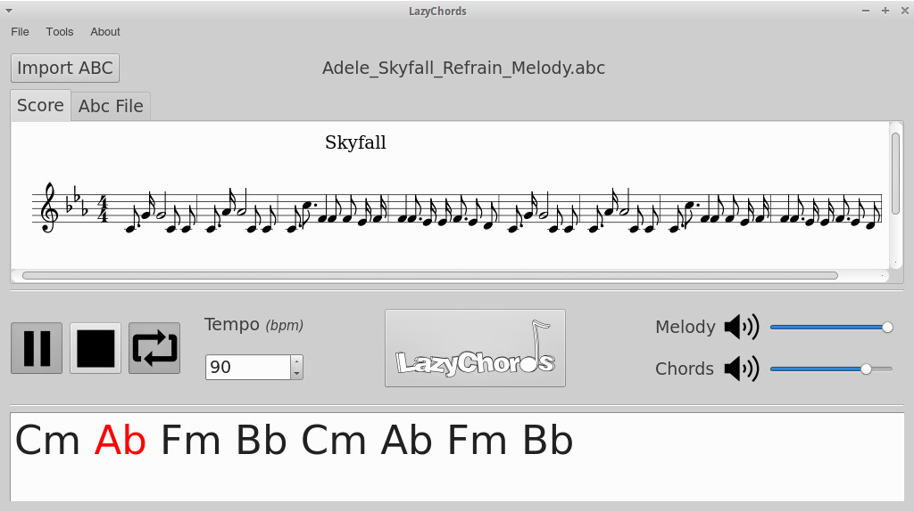

# Gui of the LazyChords project

This is provides a userfrendly inteface to the Lazychords project.

## Goal of the project

This project aims at providing a tool to allow musicians to find suitable accompaniments for their melodies. Currently, we focus on providing a good Chord Progression that fits the melody, and that sounds as well as possible.

This can be useful independently of the user's musical skills : 
* For beginners, it allows a quick generation of an a ready-to-play accompaniement without any theoretical background about composition.
* For advanced musicians, the software can be a source of interesting/unusual ideas, and speed up the overall composition process by providing a strong basis to start with.
* 

## How does it work ?

The software relies on a dynamic algorithm, that tries to apply expertly designed music rules to the melody. The rules allow to score a given chord progression with respect to a melody, and the algorithm's task is to find the chord progression that maximizes this score.

## What does it look like ?

The interface consist of a rendering of the melody score, the chord progression generated, and a toolbox to playback the melody and the chord progression simultaneously.




## Build instruction

To build the project, you need a recent C++ compiler (this project uses C++11, supported since gcc4.8), cmake, make, Qt5 and the Boost library.

```
https://github.com/lazychords/lazychords-gui.git
sed -i 's/git@github.com:/https:\/\/github.com\//' .gitmodules
sudo apt-get install cmake make g++ libboost-dev  libboost−filesystem−dev qt5-default libqt5webkit5
git submodule update --init --recursive
mkdir build && cd build
cmake ..
make -j
```
